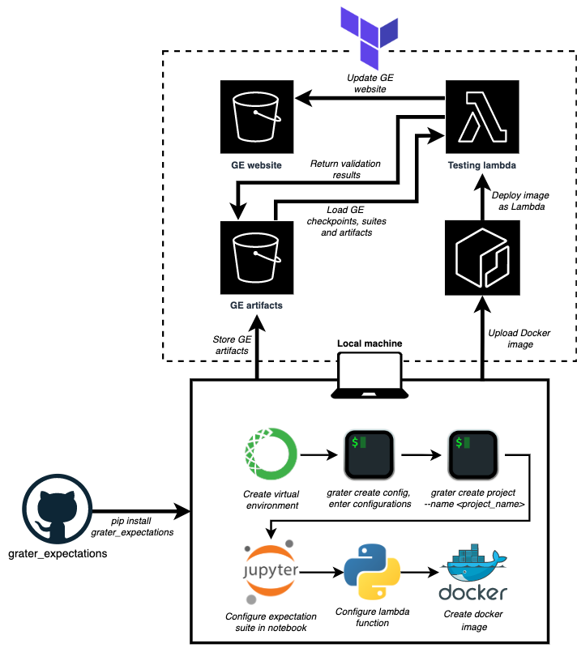
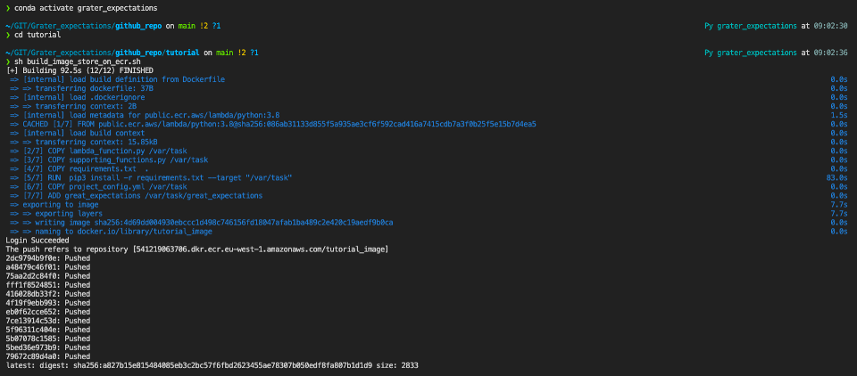

# WWF EWS Testing

To test the data used within the WWF Illegal Deforestation project at multiple stages,
Great Expectations can be used to create expectations and run validations.

This repository stores code that is used to run Docker containers on AWS Lambda to validate
data when the pipeline runs. An example of this can be found in wur_input_tests, which stores expectations run on input data from WUR (used for Gabon).

In addition, this repository contains bootstrap files, code and logic to quickly set up
a new project if new expectations must be formulated for data flows at a different stage or for new data flows. Below, it will be further explained how this can be used to start a new project.

## Table of contents
* [Project decisions](#project-decisions)
* [General setup](#general-setup)
* [Setting up your system](#setting-up-your-system)
* [Creating a new project](#creating-a-new-project)
* [Writing expectations](#writing-expectations)
* [Configuring the validation lambda](#configuring-the-validation-lambda)
* [Deploying the lambda as Docker image on ECR](#deploying-the-lambda-as-docker-image-on-ecr)
* [Deploying the Lambda and incorporation in Step Functions](#deploying-the-lambda-and-incorporating-it-in-step-functions)

## Project decisions
In order to run data tests at WWF, a couple of decisions have been made to make future
implementations of tests easier. Below, these are listed:

1. Great Expectations is the package used for running tests
2. Any files and artifacts generated by Great Expectations will be stored on S3
3. Batches of data will always be loaded at runtime, using loading logic defined by the 
developer
4. Sets of tests (expectation suites) are developed using an iPython notebook available 
in this repository
5. The logic to validate data at runtime is deployed as a Lambda function using a Docker
image (to circumvent package size constraints of lambdas)
6. Terraform code is available to spin up the required S3 objects, but this can also be
done manually
7. The validation Lambda function (and related Step Functions) should be deployed using
the Serverless Framework (the code of which is stored in [this repository](https://bitbucket.org/aimdeloittenl/wwf_ews/src/development/02_code/serverless/))
8. The code and logic contained within this repository should be able to run on both
Windows and Mac OS

## General setup

The general setup for using this repository is as follows:



Below, each of the steps are further detailed.

## Setting up your system
In order to start using this repository, it must be first cloned to your local machine.

After cloning the repository, it is highly recommended that you create a new virtual 
environment to run the code in. A requirements.txt file is available in the repository
that contains all necessary packages to run this code on Python 3.8.

If you use [anaconda](https://www.anaconda.com/products/distribution), a new environment 
can be installed as follows (if you run it from the root of the repository):

```bash
conda create --name wwf_ge_testing python=3.8
conda activate wwf_ge_testing
pip install -r requirements.txt
```

Apart from that, several other things are required to be able to run all components of 
this project. These are:
- Docker: to create new images to run on AWS Lambda and push them to ECR
- AWS CLI: to login to AWS, create an ECR repository and push docker images to ECR
- Python IDE (e.g. VS Code, optional): for easier development (not necessarily for notebooks, but definitely for Python files)
- Terraform (optional): to spin up S3 buckets for GE artifacts and the Data Docs website

## Creating a new project
When you want to develop a new set of tests for a specific dataset (set of tiles), 
you first need to add new configurations for said project. This can be done by adding
a new project to the testing_config.yml file in the root of the repository.

Nested under the project name (e.g. wur_input_tests), the configuration file is expected to contain the following keys:

- store_bucket: the S3 bucket that can be used to store Great Expectations outputs
- store_bucket_prefix: the prefix (or 'folder') in which the outputs should be stored
- site_bucket: the S3 bucket that can be used for rendering Data Docs (static GE website)
- site_bucket_prefix: the prefix (or 'folder') in which the files for the site should be stored
- site_name: the name that should be given to the rendered website
- docker_image_name: the name that will be used for the docker image and ECR repository
  to store the image
- expectations_suite_name: the name for the expectation suite you will generate (
  an expectations suite is GE jargon for a bundle of expectations you will use to validate
  a dataset)
- checkpoint_name: name for the checkpoint that will be used to validate your dataset
  at runtime. Checkpoints are used to bundle expectation suites with data to
  validate at runtime
- run_name_template: the template to be used to tag validation runs with. If given
  date string formats, these will be rendered at runtime using the date at runtime
- data_bucket: the S3 bucket in which the data resides
- prefix_example: prefix of an example tile that can be used to generate an expectation
  suite for

Below you can find an example of a filled in configuration:


In the testing_config.yml file there are also two global configurations, namely **account_id** and **region**. Although it is unlikely that the account_id will differ for a new project, if the region does, make sure to adjust this in the project configuration file after initialization (project_config.yml, see below).

After adding the required configurations in testing_config.yml, your new project can be initialized by calling initialize_project from the command line and passing the name of the project (mirroring the name you put down in the config) as -p or --project argument. Note that this is best done using the previously created virtual environment. You should run the script from the root directory of the repository.

For example, assuming you created the wwf_ge_testing virtual environment, you entered
the required configuration in testing_config.yml under the name test_configuration and you started a terminal in the root directory of the repository, a new project can be initialized as follows:

```bash
conda activate wwf_ge_testing
python initialize_project.py --project test_configuration
```

When the initialization runs correctly, a new project directory with related files will be setup for you and a Python notebook will be opened to start writing your first
expectation suite. The newly created directory will look like this:


## Writing expectations

After initializing a new project, an iPython notebook called expectation_suite.ipynb will automatically open, containing information on how to start configuring your project and writing your expectations. If you want to (re-)open said notebook at a later stage, you can do so by calling the following command from the terminal in the project directory:

```bash
conda activate wwf_ge_testing
nbopen expectation_suite.ipynb
```

Apart from the guidance the notebook provides, it is **important to note** that the majority of the functions used in the notebook should be stored in supporting_functions.py. This is because many functions in this notebook are also needed in the lambda function and by storing these in a seperate Python file, you ensure your code is DRY.

## Configuring the validation lambda

After generating a testing suite, a checkpoint to run and a Data Docs website, the next step is to set up a Lambda function that can be called to validate new batches of data against the generated expectation suite.

When `initialize_project.py` is run, an initial setup for this can be found in lambda_function.py. To make this Lambda function work, there are a few things that need specific attention:

1. Logic for loading data: at runtime, the lambda needs to be able to load a batch of data to memory (as pandas DataFrame) in order to run validations. Hence, it requires logic to do so. If you've previously created such logic for the expectation_suite.ipynb and stored that in supporting_functions.py, you should import it into the lambda function and re-use it.
2. Event information for loading data: in order for the lambda function to figure out what to load, the lambda has been set up to expect such information in the event parameter passed at runtime. E.g. for WUR input testing for Gabon, the prefix of the tile to be loaded from S3 is passed in the event during runtime (in s3_key). Along with data loading logic, this is sufficient for the lambda to retrieve a batch of data

After ensuring that the Lambda can load new data and knows what to load, the next step is to deploy the lambda as a Docker image on ECR

## Deploying the lambda as Docker image on ECR

Because there are size constraints when it comes to using Python packages on AWS Lambda (max 250MB of loaded packages through layers), the decision was made to use Docker images instead (for which the size constraint is 10GB).

Although this decision increases the complexity of the deployment a bit, `initialize_project.py` already provides you with all the boilerplate code you need to create a Docker image and load it to ECR. Said logic can be found in:
- Dockerfile: this file contains the required steps to build a new Docker image to deploy on AWS
- build_image_store_on_ecr.sh: bash script containing all steps to create a new Docker image using the Dockerfile and load it to ECR, provided you have the AWS CLI installed and your user credentials can be accessed

Before deploying, however, make sure that:
- The code in lambda_function.py properly functions, as this forms the main script of the Docker image
- All functions that the lambda function needs are accessible either through (1) imports from supporting_functions.py or (2) direct function definitions in lambda_function.py

After doing so, build_image_store_on_ecr.sh can be run from the project directory. This script will build a new Docker image for Python 3.8, install all dependencies within it using requirements.txt and copy required code- and configuration files onto the image (supporting_function.py, lambda_function.py, project_config.yml and great_expectations/great_expectations.yml). Next, it will create a new repo on AWS ECR (if needed) and upload the Docker image to it. The output in the terminal should look as follows:



**NOTE**:  
For Windows users, the build_image_store_on_ecr.sh will not work when called from CMD or Powershell. Instead, use Git Bash (which is automatically installed on your machine when you install Git) to call the bash script. Before doing so, make sure that you export your credentials in the terminal, so it can interact with AWS. Your commands should look as follows:

```bash
# Set credentials
export AWS_ACCESS_KEY_ID=<enter_aws_access_key_here>
export AWS_SECRET_ACCESS_KEY=<enter_aws_secret_access_key_here>

# Run script (from project directory)
sh build_imstage_store_on_ecr.sh
```

## Deploying the Lambda and incorporating it in Step Functions

After deploying the Docker image on ECR, it can be used in an AWS Lambda. For this project, however, the decision was made to deploy Lambda's and Step Functions via the Serverless framework. Hence, the configurations and code to do so sit in the main repository for this project, [wwf-ews](https://bitbucket.org/aimdeloittenl/wwf_ews/src/development/). 

Please refer to that repository for deploying Lambda's and Step Functions. More information on the Serverless framework can be found [here](https://www.serverless.com/framework/docs).

